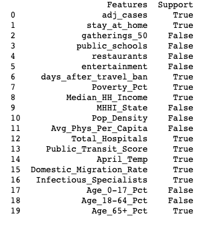
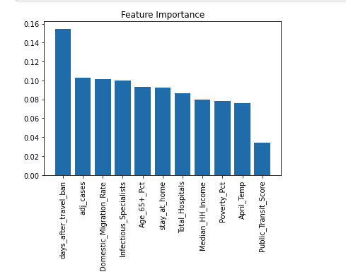

# COVID-19 Vulnerability
ML models for predicting COVID-19 vulnerability on a county-level in the US

## Summary
Worked with Professor Temiloluwa Prioleau and partner Jack Keane. We used county-level socioeconomic indicators (e.g. median household income, political leaning, population density) to predict extent of COVID-19 outbreaks in U.S. counties. Classified counties as either low-risk, medium-risk, or high-risk. Developed four machine learning models: linear support vector classified, support vector classifier, K-Nearest Neighbors, and Random Forest using `Sklearn` library. 

## How to Run
* `git clone https://github.com/mattroth17/COVID-19_Vulnerability`
* `jupyter notebook COVID-19_Vulnerability.ipynb`

## Data Sets
* [Github Repo with data sets](https://github.com/JieYingWu/COVID-19_US_County-level_Summaries)
  * [Johns Hopkins Confirmed Case Data](https://github.com/JieYingWu/COVID-19_US_County-level_Summaries/blob/master/data/infections_timeseries.csv)
  * [County Socioeconomic Indicators](https://github.com/JieYingWu/COVID-19_US_County-level_Summaries/blob/master/data/counties.csv)
  * [Government Intervention Data](https://github.com/JieYingWu/COVID-19_US_County-level_Summaries/blob/master/data/interventions.csv)
  
## Technical Tools
* All the work for this project was done in Python in a Jupyter Notebook.
* Libraries used: 
  * `pandas`, `numpy`, `sklearn`
* Models (all from `sklearn`): 
  * `LinearSVC`, `SVC`, `KNeighborsClassifier`, `RandomForestClassifier`
  
## Project Structure

### Link to Paper
Throughout the project, research paper was written/revised to reflect our data sources, methodology, results, and limitations. PDF can be found at this [link.](https://drive.google.com/file/d/1YandycYgg7J3uQBkvS1RvzdjS-lb2-Wl/view?usp=sharing) Check out the paper for a deeper dive into our process. 

### Features
#### Shows distribution of the types of features we obtained from the open-source datasets

### Feature Selection
#### Used L1-Based Feature Selection to narrow down features to ~ 15

### Confusion Matrix for Random Forest Model

### Feature Importance from RF
#### Notably, government measures seem to have been very important 

