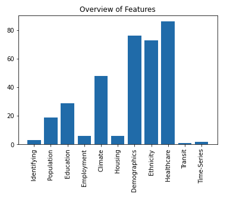
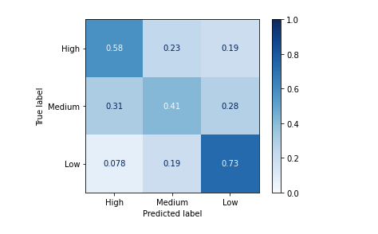

# COVID-19 Vulnerability
ML models for predicting COVID-19 vulnerability on a county-level in the US

## Summary
Worked with Professor Temiloluwa Prioleau and partner Jack Keane. We used county-level socioeconomic indicators (e.g. median household income, political leaning, population density) to predict extent of COVID-19 outbreaks in U.S. counties. Classified counties as either low-risk, medium-risk, or high-risk. Developed four machine learning models: linear support vector classified, support vector classifier, K-Nearest Neighbors, and Random Forest using `Sklearn` library. 

### Link to Paper
Throughout the project, research paper was written/revised to reflect our data sources, methodology, results, and limitations. PDF can be found at this [link.](https://drive.google.com/file/d/1YandycYgg7J3uQBkvS1RvzdjS-lb2-Wl/view?usp=sharing) Check out the paper for a deeper dive into our process. 

## How to Run
* `git clone https://github.com/mattroth17/COVID-19_Vulnerability`
* `jupyter notebook COVID-19_Vulnerability.ipynb`

## Data Sets
* [Github Repo with data sets](https://github.com/JieYingWu/COVID-19_US_County-level_Summaries)
  * [Johns Hopkins Confirmed Case Data](https://github.com/JieYingWu/COVID-19_US_County-level_Summaries/blob/master/data/infections_timeseries.csv)
  * [County Socioeconomic Indicators](https://github.com/JieYingWu/COVID-19_US_County-level_Summaries/blob/master/data/counties.csv)
  * [Government Intervention Data](https://github.com/JieYingWu/COVID-19_US_County-level_Summaries/blob/master/data/interventions.csv)
  
## Technical Tools
* All the work for this project was done in Python in a Jupyter Notebook.
* Libraries used: 
  * `pandas`, `numpy`, `sklearn`
* Models (all from `sklearn`): 
  * `LinearSVC`, `SVC`, `KNeighborsClassifier`, `RandomForestClassifier`
  
## Project Structure

#### Data Cleaning and Labeling
* Counties with missing data were removed
* Age data was converted to a percentage of the population instead of total pop. in certain age range
* Confirmed cases were converted to per capita rather than total cases
* Data sets were combined in order to have both confirmed case data and socioeconomic indicators/intervention data in the same `pandas` dataframe

##### Labeling Counties as High, Medium, or Low Risk 
* If a county had reached threshold of 25 cases per 100k, find the date that threshold was hit
  * Calculate percent increase in cases over two weeks
  * Split up counties into three classes based on two-week increase: high, medium, low
* Else
  * Counties that had not yet hit threshold were not included in model training/testing
  * These counties act as "unseen" data, vulnerability can be predicted by trained models upon hitting threshold
  
##### Splitting Up Counties into Three Classes

### Features
#### Shows distribution of the types of features we obtained from the open-source datasets

### Feature Selection
#### Used L1-Based Feature Selection to narrow down features to ~ 15
* `from sklearn.feature_selection import SelectFromModel`

### Grid-Search Paramter Tuning
* key function: `def get_best_model(X_train, y_train, models)`
  * takes training data and labels, as well as types of models (e.g. SVC)
  * outputs the best model (in terms of best F1-Score average across classes) and the best parameters

### Confusion Matrix for Random Forest Model

### Feature Importance from RF
#### Notably, government measures seem to have been very important 

